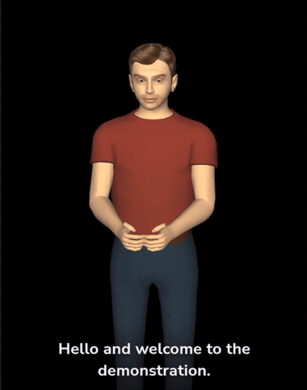

<h1 align="center">Hi, I'm Melvin Sharees </h1>

  <b>Computer &amp; Autonomous Systems Engineering student</b> — Robotics · AI/ML · Embedded · Data

  
  

---

##  Featured projects

### Lensø — Real-time Speech → Sign-Language Wearable
Offline speech-to-sign on a **Raspberry Pi**: Vosk speech recognition → NLP → **SiGML 3D avatar** in the browser. Lead software integrator on a 5-person team; live-demoed at the Innovation Fair.

`Python` · `Raspberry Pi` · `Vosk` · `NLP` · `Computer Vision`

**➡️ [View repository](https://github.com/Melvinsharees/lenso-avatar)**

### Autonomous Smart Sorter Robot
A **Pioneer 3-DX** robot in **Webots** (C) that finds coloured balls with its camera and sorts each into the correct goal using a finite-state machine, wheel-odometry localisation, and obstacle avoidance.

`C` · `Webots` · `Computer Vision` · `Finite-State Machine` · `Robotics`

**➡️ [View repository](https://github.com/Melvinsharees/autonomous-sorter-robot)**

## 📂 More projects

| Project | What it is | Tech |
|---------|------------|------|
| **[Statistical Analysis](https://github.com/Melvinsharees/statistical-analysis)** | Machine-failure risk analysis (distributions, confidence intervals, hypothesis tests) + heart-rate linear regression &amp; ANOVA | MATLAB · Excel |
| **[Op-Amp Function Generator](https://github.com/Melvinsharees/op-amp-function-generator)** | Analog square/triangular/sine generator, tunable ~544 Hz–55 kHz, taken to a PCB layout | Multisim · Ultiboard · PCB |
| **[Vending Machine Controller](https://github.com/Melvinsharees/vending-machine-c)** | Console vending machine — state-machine menu, coin payment &amp; change, password-protected admin mode | C |
| **[Projectile Simulation](https://github.com/Melvinsharees/Projectile-Simulation-MATLAB)** | Projectile motion over a building — solves the minimum launch angle &amp; speed to clear it and hit a target, with a MATLAB App GUI | MATLAB · App Designer |

## 🛠️ Skills

**AI / Data:** Speech Recognition (Vosk / Whisper) · NLP · Computer Vision · Statistical Analysis · Hypothesis Testing
**Systems / Tools:** Webots · Multisim · Ultiboard · Finite-State Machines · Embedded Systems · Git

<i>Open to internships and graduate roles in robotics, embedded, and software engineering.</i>

